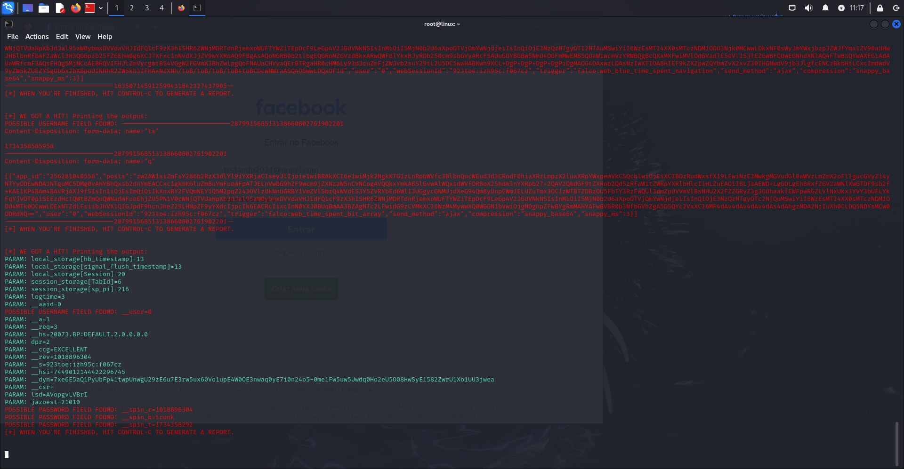

# cibersecurity-desafio-phishing
Phishing para captura de senhas do Facebook

### Ferramentas

-Kali Linux<br>
-setoolkit

### Configurando o Phishing no Kali Linux

-Acesso root: ``` sudo su ```<br>
-Iniciando o setoolkit: ``` setoolkit ```<br>
-Tipo de ataque: ``` 1) Social-Engineering Attacks ```<br>
-Vetor de ataque: ``` 2) Web Site Attack Vectors ```<br>
-Método de ataque: ``` 3) Credential Harvester Attack Method ```<br>
-Método de ataque: ``` 2) Site Cloner ```<br>
-Obtendo o endereço da máquina: ``` ifconfig ```<br>
-URL para clone: ``` http://www.facebook.com ```<br>

### Resultados


